# AppCall Project

A brief description of your project.

## Getting Started

These instructions will get you a copy of the project up and running on your local machine for development and testing purposes. See deployment for notes on how to deploy the project on a live system.

### Prerequisites

What things you need to install the software and how to install them:

- Node.js
- npm
- MongoDB
- Tailwind CSS (included as part of the project)
- Mailtrap (for email testing)

### Installing

A step-by-step series of examples that tell you how to get a development environment running:

1. Clone the repository:

    ```bash
    git clone https://github.com/AliElmissaoui/App-Call.git
    ```

2. Install dependencies:

    ```bash
    npm install
    ```

3. Add default data to the database:

    ```bash
    node src/config/createDefault
    ```

4. Start the development server:

    ```bash
    npm run start
    ```

   Navigate to `http://localhost:3001/login` in your browser to view the app.

5. Run the development server with live CSS updates:

    ```bash
    npm run watch:css
    ```

### Login Credentials

Use the following credentials to log in to the app:

- **Supervisor Email**: `supervisor@gmail.com`
- **Password**: `supervisor123`

These credentials are for testing purposes. You can create your own users through the app or by modifying the default data in the database.

### Email Testing with Mailtrap

This project uses [Mailtrap](https://mailtrap.io/) to test and debug email functionality in a development environment. Mailtrap allows you to capture and inspect outgoing emails without actually sending them to real users.

To use Mailtrap:

1. Create a Mailtrap account at [mailtrap.io](https://mailtrap.io/).
2. Set up your Mailtrap inbox.
3. Configure the email settings in the project by adding Mailtrap's SMTP credentials to your `.env` file, like this:

    ```plaintext
    MAILTRAP_HOST=smtp.mailtrap.io
    MAILTRAP_PORT=2525
    MAILTRAP_USER=<your-mailtrap-username>
    MAILTRAP_PASSWORD=<your-mailtrap-password>
    ```

    Replace `<your-mailtrap-username>` and `<your-mailtrap-password>` with your Mailtrap account details.

4. Once configured, emails sent from the app will be captured and displayed in your Mailtrap inbox.

5. Project Screenshots

### 1. **Login**  
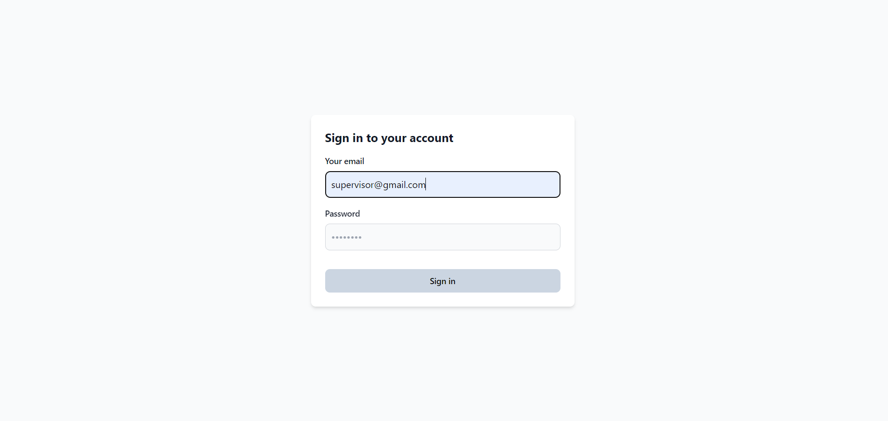

### 2. **Edit Account**  
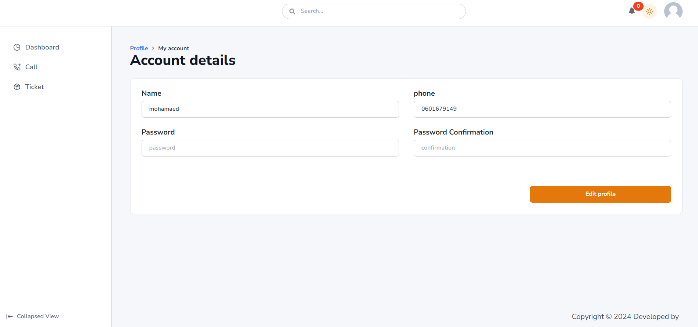

### 3. **Add Agent**  
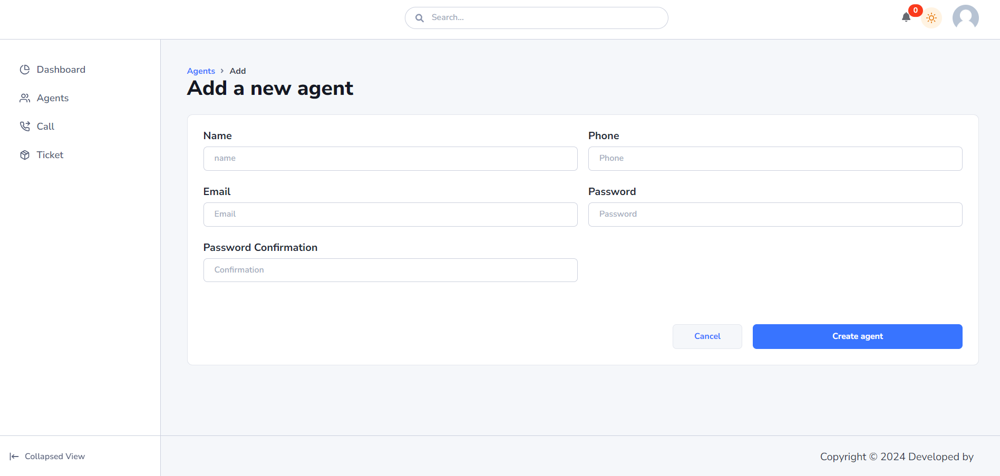

### 4. **All Agents**  
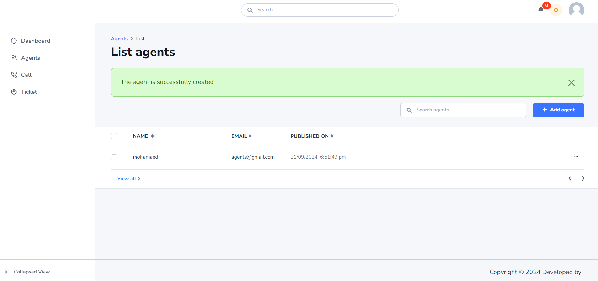

### 5. **View Agent**  
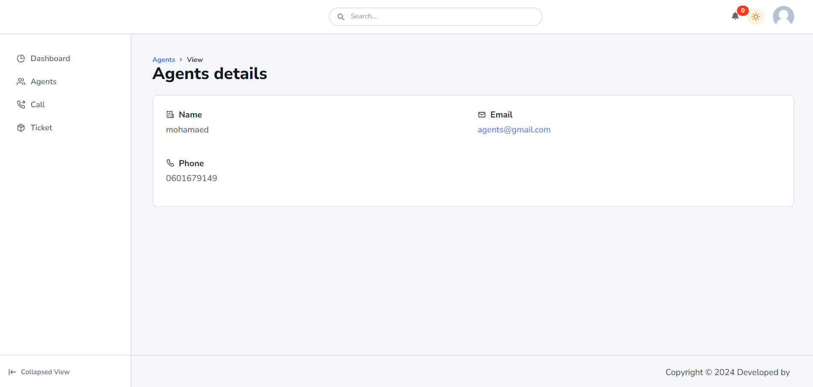

### 6. **Add Call**  
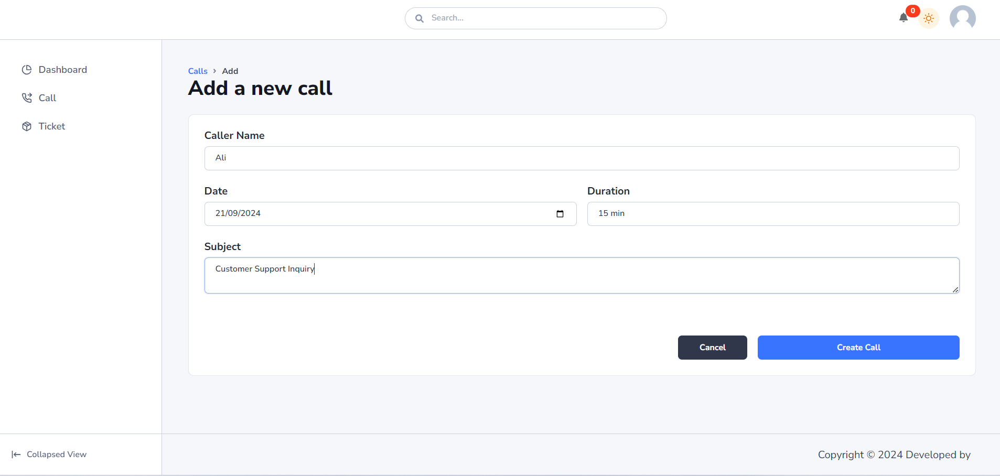

### 7. **View Call**  
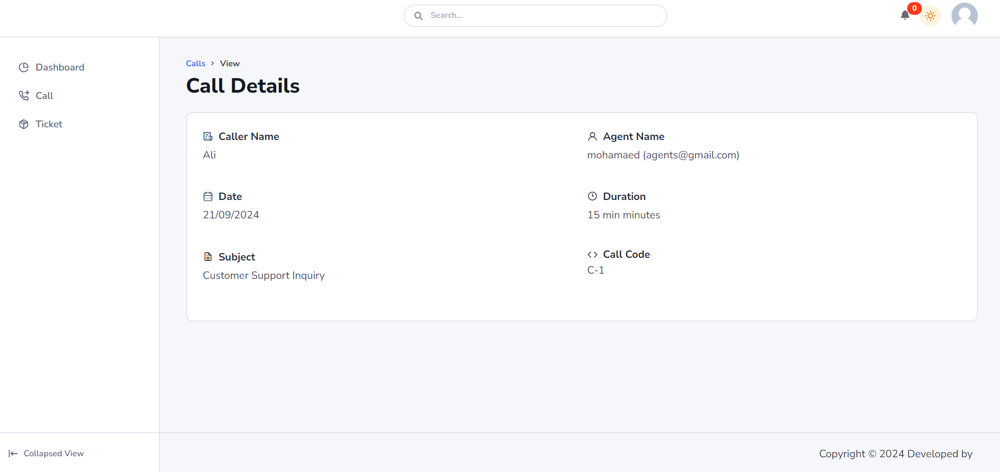

### 8. **Edit Call**  
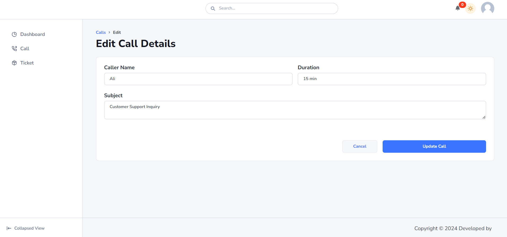

### 9. **Add Ticket**  
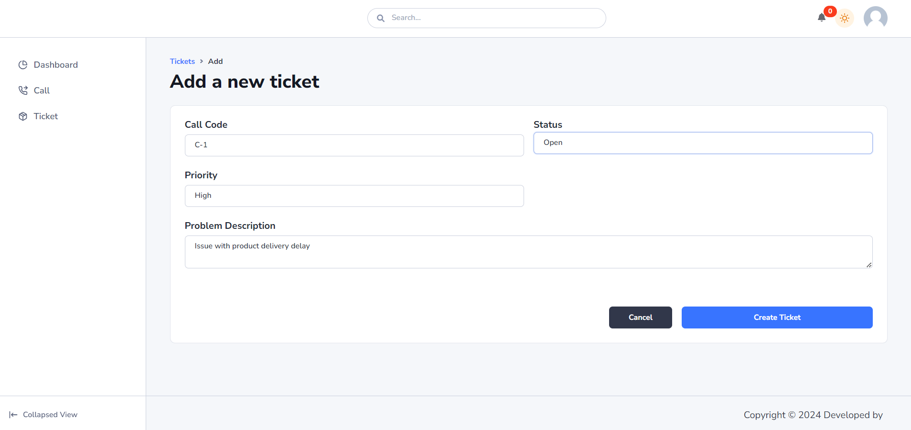

### 10. **Edit Ticket**  
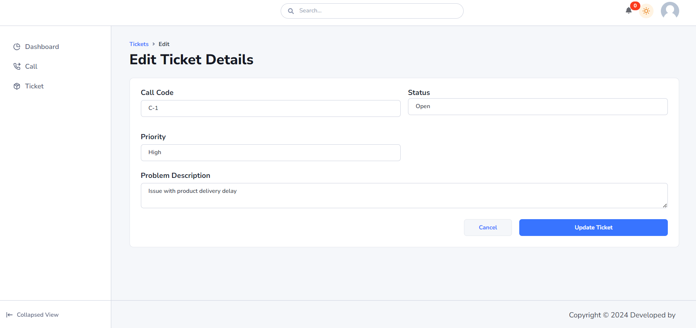

### 11. **View Ticket**  
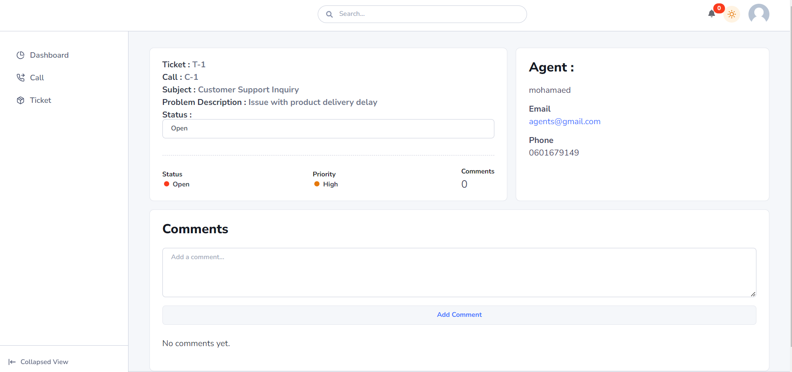

### 12. **All Tickets**  
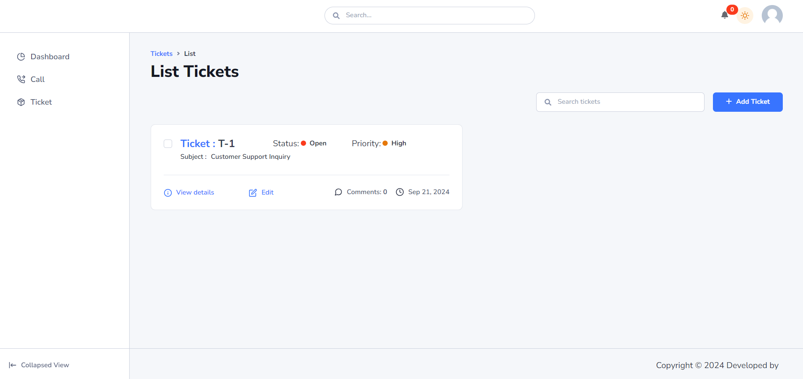

### 13. **All Tickets (Supervisor)**  
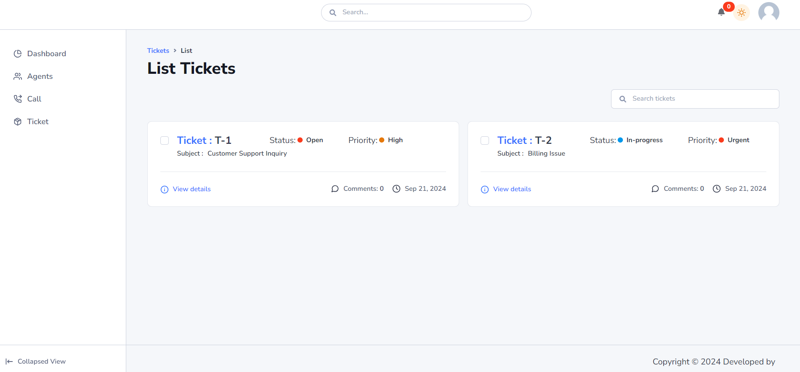

### 14. **Update Status**  
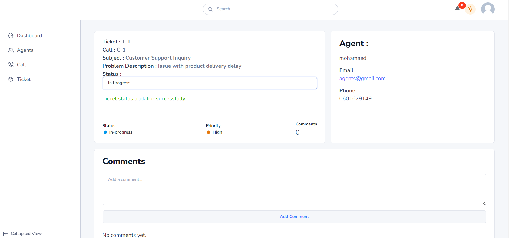

### 15. **Mail - Agents**  


### 16. **Mail - Supervisor**  
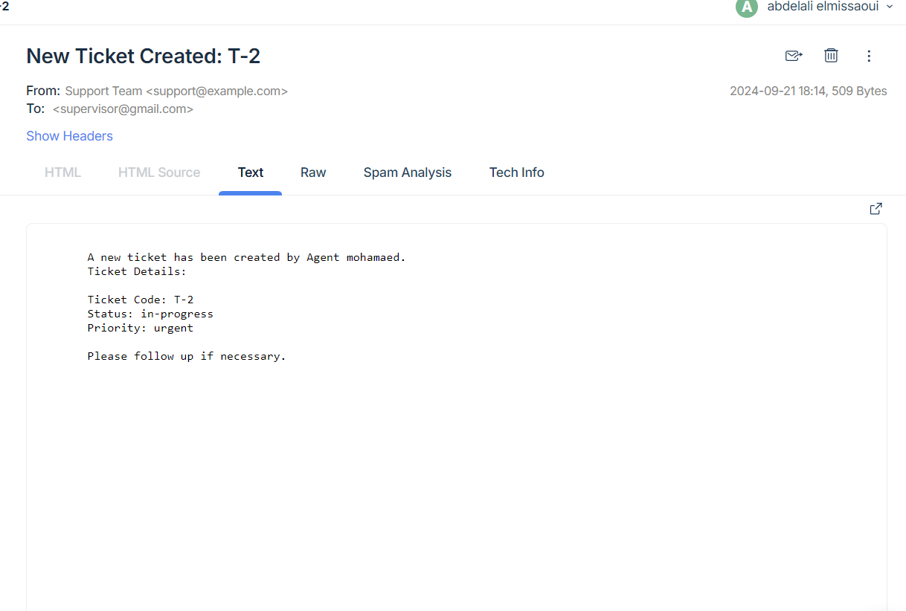

### 17. **Mail - Update Status**  
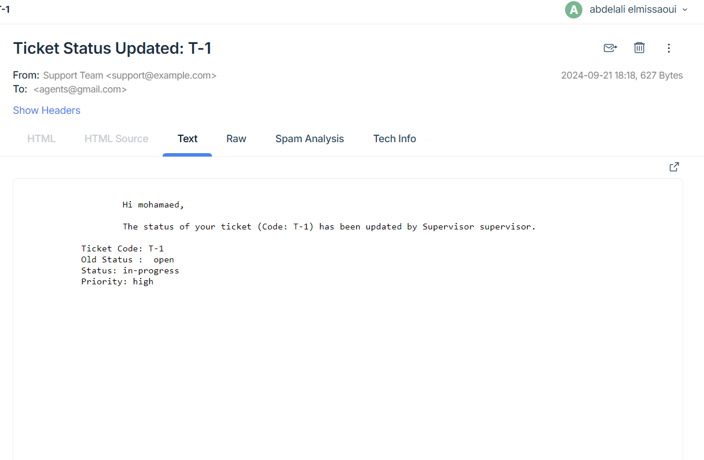

### 18. **Mail - Update Status (Supervisor)**  
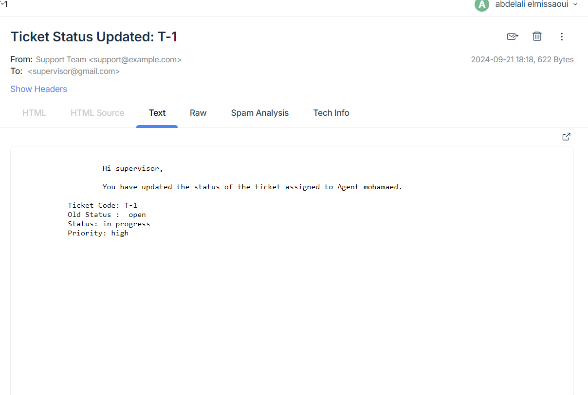


### Built With

- **Express.js** - Web framework for Node.js
- **MongoDB** - NoSQL database
- **Tailwind CSS** - CSS framework
- **Mailtrap** - Email testing service
